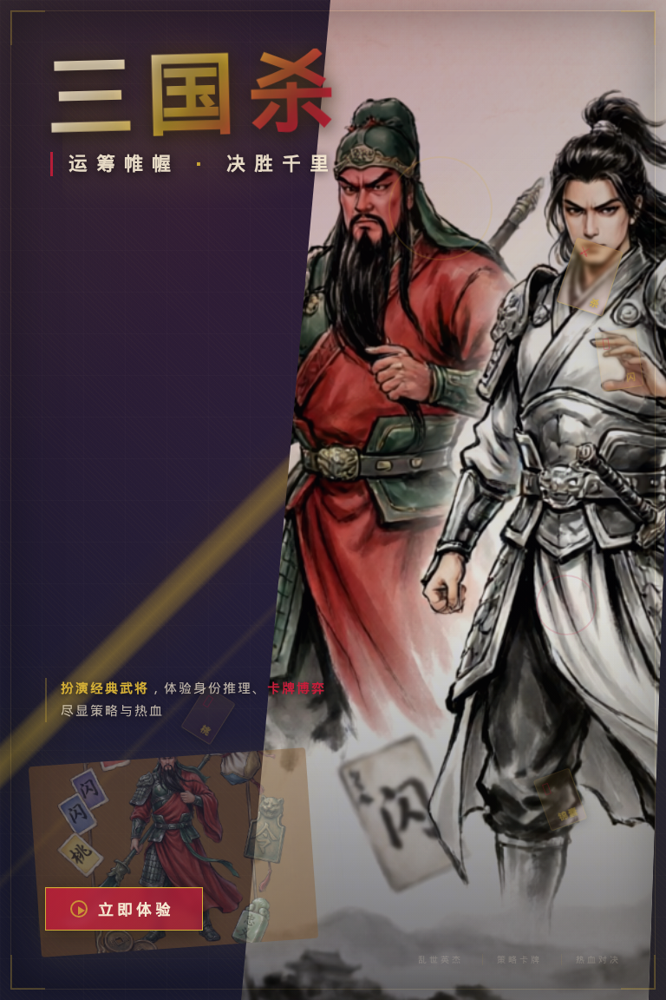

# PostAI

## 多 Agent 智能海报生成系统

从自然语言需求出发，生成 可编辑 HTML/CSS 海报 与 PNG 成品

  

    
Input

    
Prompt

  

  

    
Process

    
Agent Workflow

  

  

    
Output

    
HTML + PNG

  

<!--
开场：PostAI 不是单纯文生图，而是一个海报设计工作流。
-->

---

# 背景问题

## 为什么不能只靠一次文生图？

  

    <h3 class="text-red-200">单次图像生成</h3>
    <ul class="mt-5 text-xl leading-9 opacity-85">
      <li>文字和排版难以精确控制</li>
      <li>生成结果通常不可编辑</li>
      <li>失败后只能重新抽卡</li>
      <li>缺少明确的质量检查点</li>
    </ul>
  

  

    <h3 class="text-sky-200">PostAI 的目标</h3>
    <ul class="mt-5 text-xl leading-9 opacity-85">
      <li>把海报创作拆成可观察步骤</li>
      <li>保留 HTML/CSS 编辑源文件</li>
      <li>通过 VLM 反馈进行迭代</li>
      <li>在无模型时仍可 fallback 运行</li>
    </ul>
  

<!--
重点：项目目标不是追求一次生成最漂亮，而是让生成过程可控、可调试、可迭代。
-->

---

# 核心思想

## 把“画一张海报”拆成设计流水线

  
内容理解

  
→

  
艺术指导

  
→

  
HTML 布局

  
→

  
浏览器渲染

  
VLM 评审

  
→

  
Router 决策

  
→

  
完成或迭代

每个 Agent 只负责一个明确阶段，共享状态由 <code>GraphState</code> 承载。

---

# 系统总架构

  

    <h2>主流程</h2>
    <pre class="text-sm mt-4"><code>GenerateRequest
  -> ContentExtractor
  -> IllustrationAgent
  -> StyleDirector
  -> SpatialLayoutPlanner
  -> HTMLPainter
  -> VLMCritic
  -> Router
       -> final
       -> content/style/layout iteration</code></pre>
  

  

    <h3>实现入口</h3>
    <ul class="mt-4 text-lg leading-8 opacity-85">
      <li><code>backend/app/orchestration/graph_runner.py</code></li>
      <li><code>POST /api/v1/generate</code> 同步生成</li>
      <li><code>POST /api/v1/generate/stream</code> SSE 流式进度</li>
      <li><code>POST /api/v1/refine</code> 对已有 HTML 微调</li>
    </ul>
  

<!--
这一页讲清楚：GraphRunner 是总导演，API 只是把请求转换成状态后交给它。
-->

---

# 状态中心：GraphState

  

    <h3>输入与约束</h3>
    
<code>user_prompt</code> <code>canvas</code> <code>target_score</code> <code>max_iterations</code>

  

  

    <h3>中间表示</h3>
    
<code>poster_brief</code> <code>art_direction</code> <code>generated_illustrations</code> <code>layout_html</code>

  

  

    <h3>反馈与输出</h3>
    
<code>render_result</code> <code>feedback_history</code> <code>vision_reasoning</code> <code>warnings</code>

  

Typed state 的好处：Agent 间接口清晰，API 响应可验证，测试可以直接覆盖状态机行为。

---

# ContentExtractor

## 从用户 prompt 到结构化海报 brief

  

    
输出新版 <code>PosterBriefV2</code>，再转换成兼容旧流程的 <code>ContentPlan</code>。

    
关键原则：不默认强塞标题、副标题、CTA 或主图；只保留服务海报意图的内容。

  

  <pre class="text-sm"><code>{
  poster_intent,
  content_strategy,
  messages: [
    { id, role, content, importance, presence }
  ],
  visual_subjects: [
    { id, role, description, presence, avoid }
  ],
  must_not_do
}</code></pre>

<!--
强调它像内容策划，而不是简单抽关键词。
-->

---

# Style + Illustration

## 艺术指导与可选视觉资产

  

    <h3>StyleDirector</h3>
    <ul class="mt-4 text-lg leading-8 opacity-85">
      <li>生成 <code>ArtDirectionV2</code></li>
      <li>定义 poster language、颜色系统、字体策略</li>
      <li>给布局 Agent 一个具体的视觉方向</li>
    </ul>
  

  

    <h3>IllustrationAgent</h3>
    <ul class="mt-4 text-lg leading-8 opacity-85">
      <li>从 <code>visual_subjects</code> 选择候选资产</li>
      <li>调用 OpenAI-compatible 图像生成接口</li>
      <li>失败只记录 warning，不阻塞主流程</li>
    </ul>
  

这一步把“视觉风格”和“视觉素材”分开，避免生成图像直接吞掉整个版式控制权。

---

# SpatialLayoutPlanner

## 关键选择：让 Agent 直接写 HTML/CSS

  

    <h3>为什么是 HTML/CSS？</h3>
    <ul class="mt-4 text-lg leading-8 opacity-85">
      <li>天然支持字体、层级、网格、裁切、纹理</li>
      <li>可以保存为可编辑源文件</li>
      <li>浏览器渲染确定性强，方便调试</li>
      <li>比自定义几何 schema 表达力更高</li>
    </ul>
  

  <pre class="text-sm"><code>&lt;div id="headline" data-role="headline"&gt;
  三國殺：謀定天下
&lt;/div&gt;

#key-visual {
  position: absolute;
  inset: 0;
  object-fit: cover;
  mix-blend-mode: screen;
}</code></pre>

布局 prompt 会注入 brief、art direction、参考图、生成插图和上一轮 VLM 反馈。

---

# HTMLPainter

## 用 Headless Chromium 渲染海报

  

    
<code>HTMLPainter</code> 调用 Playwright，把 HTML 设置到页面中，再按指定画布尺寸截图。

    
生成结果同时保存两份：可编辑 <code>.html</code> 和可展示 <code>.png</code>。

  

  

    <h3>工程细节</h3>
    <ul class="mt-4 leading-8 opacity-85">
      <li><code>apply_canvas_guard</code> 固定宽高</li>
      <li>禁用响应式缩放导致的空白截图</li>
      <li>把本地 asset URL 转成可渲染资源</li>
      <li>捕获浏览器 console errors</li>
    </ul>
  

---

# VLM Critic + Router

## 让系统看见自己的输出

  

    <h3>CritiqueResult</h3>
    <ul class="mt-4 text-lg leading-8 opacity-85">
      <li><code>score</code> 与 <code>passed</code></li>
      <li>视觉描述与推理摘要</li>
      <li>结构化问题 <code>structured_issues</code></li>
      <li>六维 rubric：身份、主题、构图、字体、可读性、工艺</li>
    </ul>
  

  

    <h3>Router</h3>
    <ul class="mt-4 text-lg leading-8 opacity-85">
      <li>读取 <code>revision_focus</code></li>
      <li>结合目标分数与迭代预算</li>
      <li>决定 final、layout、style、content 或 render 修复</li>
      <li>分数停滞时提前停止</li>
    </ul>
  

这使系统从“生成一次”变成“渲染后自评，再决定下一步”。

---

# API 与可用性

  

    <h3>主要接口</h3>
    <ul class="mt-4 text-lg leading-8 opacity-85">
      <li><code>POST /api/v1/generate</code></li>
      <li><code>POST /api/v1/generate/stream</code></li>
      <li><code>POST /api/v1/reference-images/upload</code></li>
      <li><code>POST /api/v1/refine</code></li>
      <li><code>GET /assets/{filename}</code></li>
    </ul>
  

  <pre class="text-sm"><code>{
  "prompt": "制作一张科技风 AI 会议海报",
  "width": 768,
  "height": 1152,
  "max_iterations": 3,
  "min_iterations": 1,
  "target_score": 85,
  "enable_generated_illustrations": true
}</code></pre>

---

# 实验与测试

## 覆盖核心风险点

  

    <h3>状态机与 API</h3>
    
同步生成、SSE、错误处理、路由决策、最少/最多迭代、分数停滞。

  

  

    <h3>渲染与资产</h3>
    
HTML 模板、canvas guard、PNG 尺寸、本地 asset、参考图和生成插图保存。

  

  

    <h3>模型客户端</h3>
    
LLM/VLM 结构化解析、fallback、图像生成响应解析。

  

  

    <h3>Golden Prompts</h3>
    
展览、爵士、招聘、讲座、夏日抽象、产品发布、音乐节等海报类型。

  

---

# 生成样例

  

    
  

  

    <h2>两轮生成后的游戏推广海报</h2>
    <ul class="mt-6 text-xl leading-9 opacity-85">
      <li>固定 768 × 1152 poster canvas</li>
      <li>真实生成插图作为 key visual</li>
      <li>HTML 中保留稳定语义 ID</li>
      <li>PNG 可展示，HTML 可继续 refine</li>
    </ul>
  

---

# 总结

  

    <h2>贡献</h2>
    <ul class="mt-5 text-xl leading-9 opacity-85">
      <li>多 Agent 可观测海报生成流程</li>
      <li>HTML/CSS 作为高表达力中间表示</li>
      <li>浏览器渲染与 VLM 评审闭环</li>
      <li>模型不可用时仍能 fallback 演示和测试</li>
    </ul>
  

  

    <h2>后续工作</h2>
    <ul class="mt-5 text-xl leading-9 opacity-85">
      <li>加入人类偏好评测</li>
      <li>OCR/readability 自动指标</li>
      <li>更强的视觉 regression benchmark</li>
      <li>更可靠的 learned refinement policy</li>
    </ul>
  

PostAI = controllable generation + editable source + iterative critique

